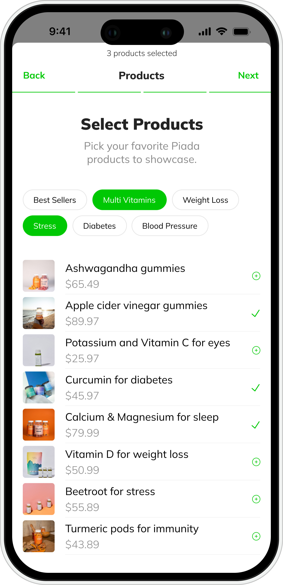

import imageRohan from '@/images/team/Rohan.jpg'

export const article = {
  date: '2023-02-18',
  title: 'Is Myplaza.io right for you?',
  description:
    'If you are a brand looking to reach a wider audience and boost sales, then Myplaza.io is definitely worth checking out. If you are an influencer looking to monetize your following and work with brands you love, then Myplaza.io is also a great option.',
  author: {
    name: 'Rohan',
    role: 'Co-Founder / CTO',
    image: { src: imageRohan },
  },
}

export const metadata = {
  title: article.title,
  description: article.description,
}

## Overall, Myplaza.io is a game-changer for the e-commerce industry. It is a platform that is making it easier than ever for brands and influencers to connect and drive sales.If you are looking for a new way to grow your business, then I highly recommend checking out Myplaza.io.

## In addition to the benefits mentioned above, here are a few other things that make Myplaza.io unique:

1.It is easy to use: Myplaza.io is very user-friendly, even for people who are not tech-savvy.

2.It is affordable: Myplaza.io offers a variety of pricing plans to fit any budget.

3.It is reliable: Myplaza.io is a platform that you can trust.

## 3. Cost Efficiency

Demand is at an all time low for commercial real-estate, which means it’s never been more affordable to cram forty people into an open plan office.

What’s more, is we’ve found that we can offer extremely low-cost perks like a snack cupboard or free beer in-lieu of higher salaries. For every foosball table we buy, we find we can offer around 5% less salary per job posting. Our full-time barista is the highest paid employee, after management.

