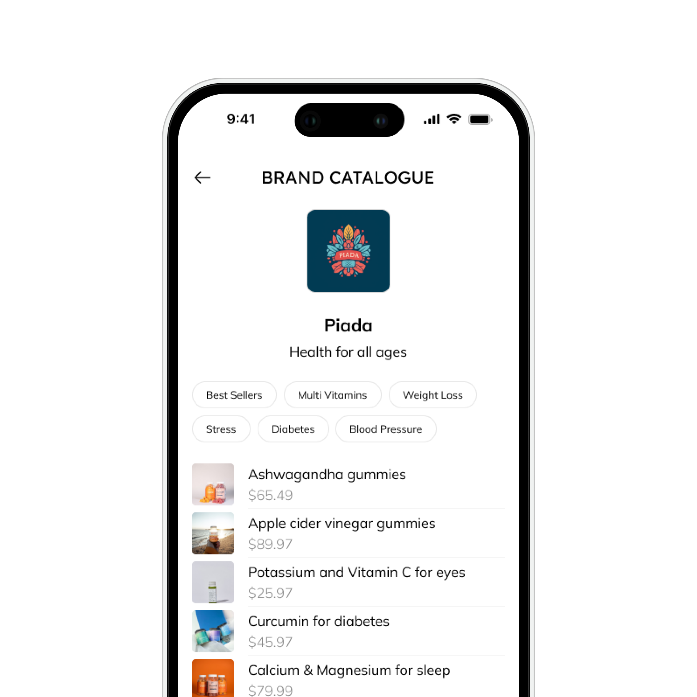

import imageVikram from '@/images/team/Vikram.jpg'

export const article = {
  date: '2023-04-06',
  title: 'What are the benefits of using Myplaza.io?',
  description:
    'There are many benefits for both brands and influencers who use Myplaza.io. For brands, the platform provides a way to:',
  author: {
    name: 'Vikram Pai',
    role: 'CEO',
    image: { src: imageVikram },
  },
}

export const metadata = {
  title: article.title,
  description: article.description,
}

## 1.Reach a wider audience: 
 By connecting with influencers, brands can tap into their large and engaged followings.
## 2. Increase brand awareness: 
Influencers can help to create buzz and excitement around a brand's products.
## 3. Boost sales: 
When influencers promote products, it can lead to a significant increase in sales.
## 4. Save time and money: 
Myplaza.io makes it easy to find and connect with influencers, saving brands time and money.
  
##  For influencers, Myplaza.io provides a way to:

  1.Monetize their following: Influencers can earn commission on every sale they make.

  2.Work with brands they love: Myplaza.io gives influencers the opportunity to partner with brands they are passionate about.
  
  3.Build their brand: By promoting products on Myplaza.io, influencers can build their credibility and reach.

